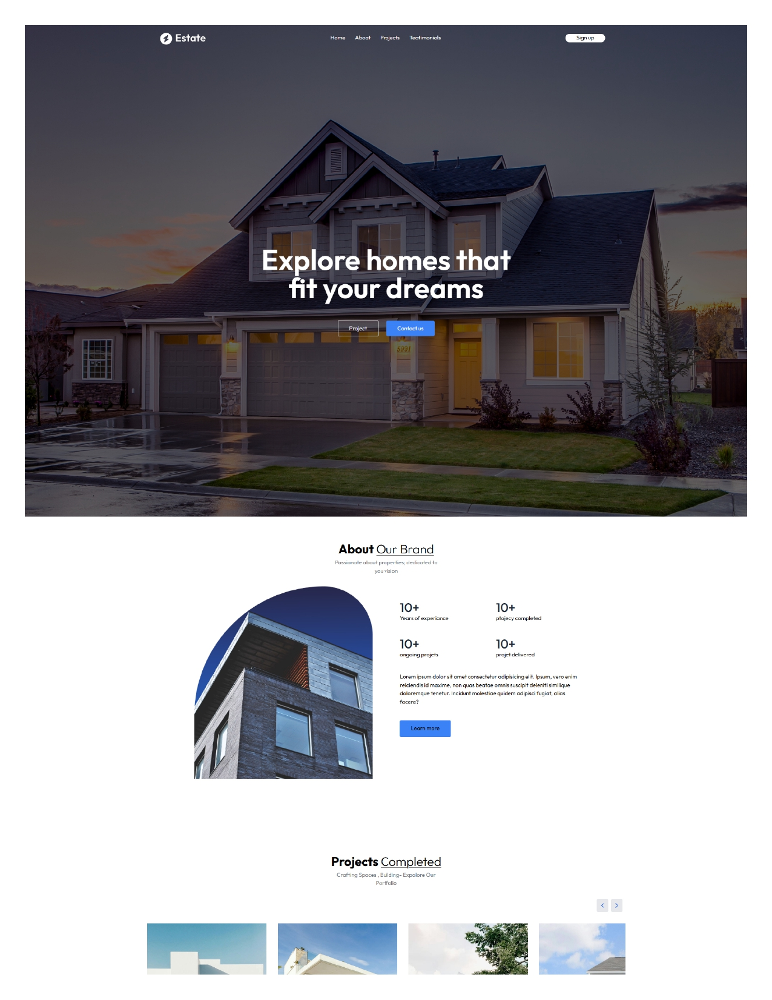
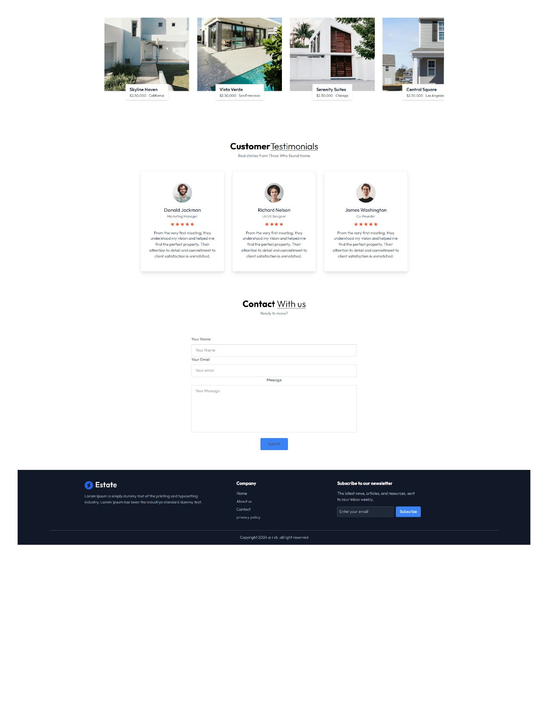
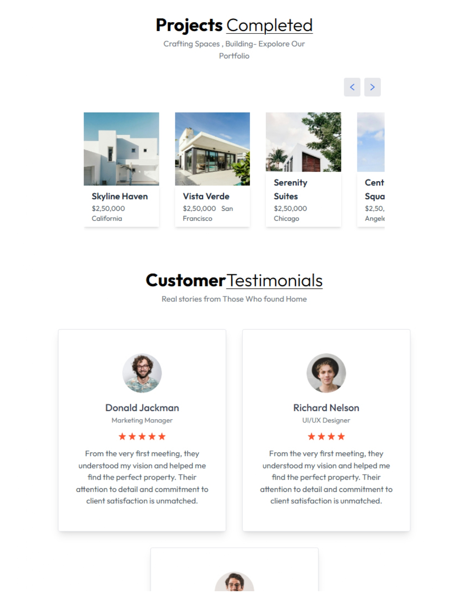
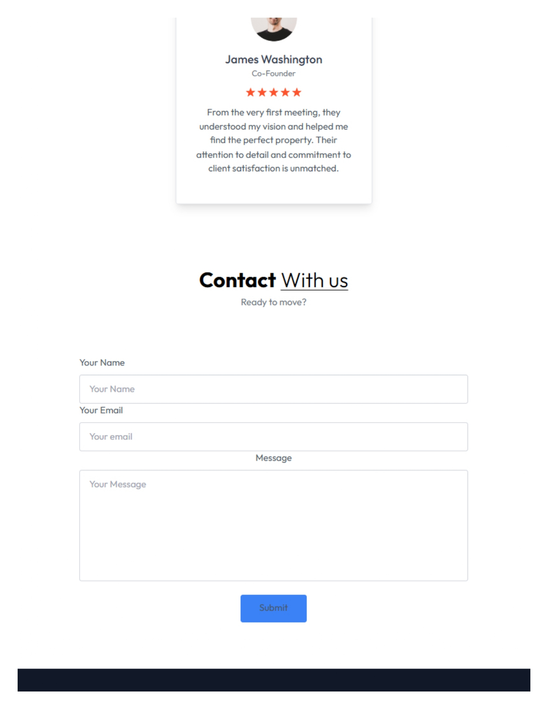
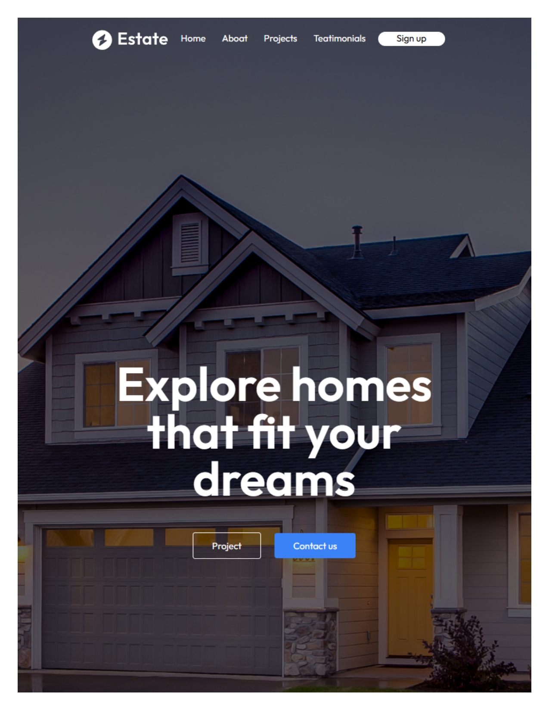
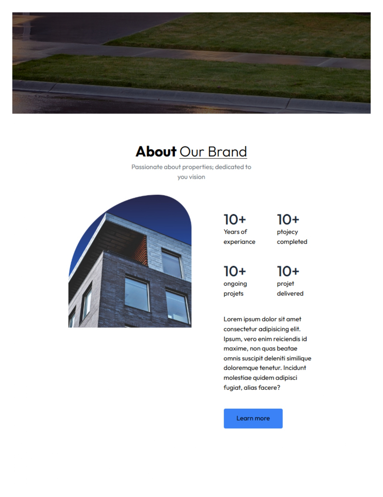

# Estate

- A landing pagewit functional contact for a real estate agengy .
<!-- - Demo: https://estate.netfly.com/ -->

## Tech Stack Client

- React
- Tailwind
- javascript
- Motion UI

## Images

<div>
    
    
    
    
    
    
</div>

## Getting Up and Running Locally

- Clone this repository to your local machine:

```bash
git clone https://github.com/RiccardoAD/real-estate
```

- Move to the cloned directory

```bash
cd estate
```

- Install dependencies

```bash
npm install
```

- Start server

```bash
npm run dev
```

## 🔗 Links

[](https://www.linkedin.com/in/riccardo-adorni-developer/)
